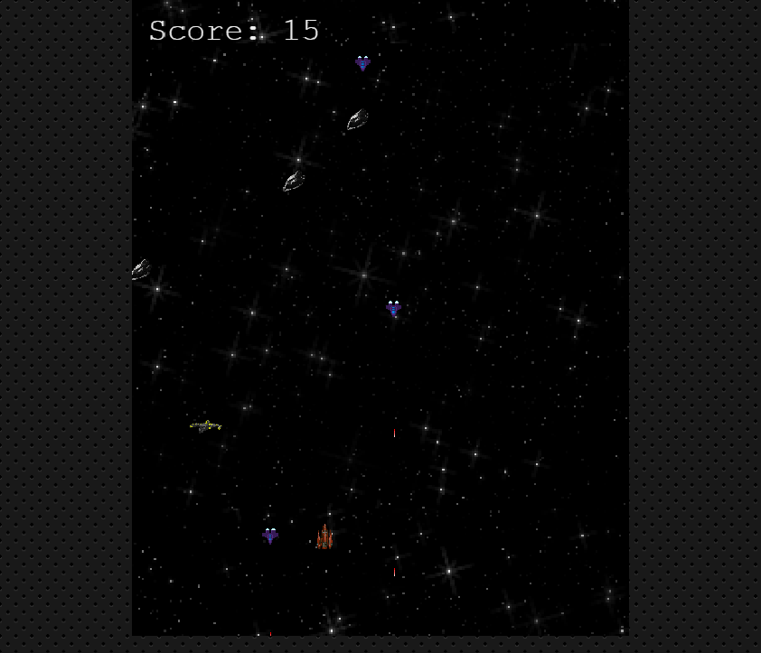
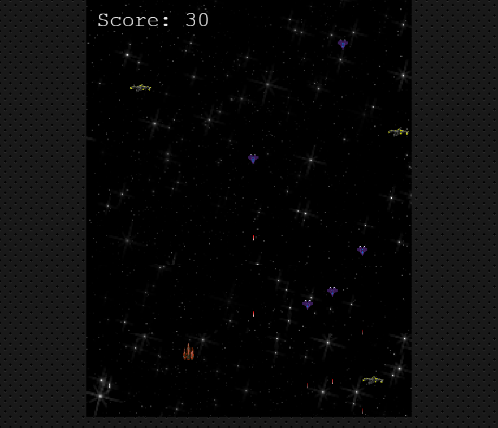
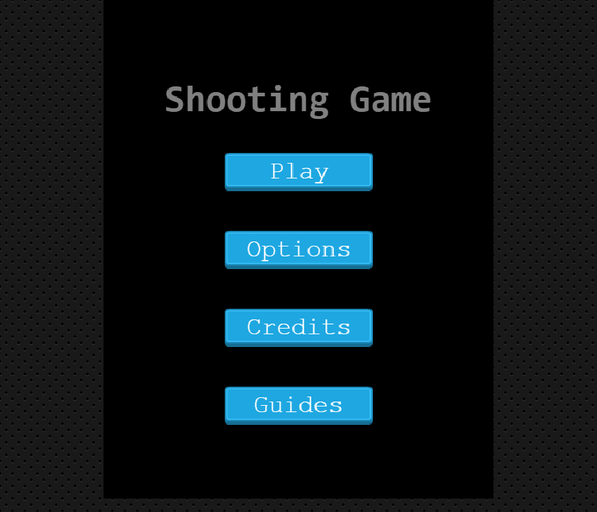

# Shooting Game
This is a custom implementation of the popular space shooter game using the [Phaser](https://phaser.io/) library.

## Outline
- [Live version](#Live-version)
- [UI Preview](#UI-Preview)
- [Description](#Description)
- [Technologies used](#Technologies)
- [Installation](#Installation)
- [Author](#author)
- [Licence](#licence)

## Live version
The game is hosted here => [fightgame](https://fightgame.netlify.app/).

## UI Preview

|                |                |
|----------------|----------------|
|||
!||


## Description
<!--  -->

## Technologies
- The game was developed with [Phaser](https://phaser.io/).
- HTML5
- Javascript
- CSS
- [Webpack 4](https://webpack.js.org/) for managing javascript assets.
- [Github Actions](https://github.com/features/actions) for CI.


## Installation
Follow the steps below run the game in a local environment; First ensure you have [Node.js](https://nodejs.org).

1. Clone the repository from a terminal 
    ```git clone https://github.com/codecell/shooting_game.git```.
2. Navigate to the project directory.
    ```cd shooting_game```
3. Install Javascript dependencies.
    ```yarn OR npm install```
4. Start the webback server.
    ```npm run start```
webpack will automatiaclly serve the compiled build on http://localhost:8081/.


## Author

👤 **Alfred Ezaka**

- Github: [@codecell](https://github.com/codecell)
- Twitter: [@the_codecell](https://twitter.com/the_codecell) 
- Linkedin: [ezaka alfred](https://www.linkedin.com/in/alfrednoble/)

## Show your support

Give a ⭐️ if you like this project!

## Licence
- MIT