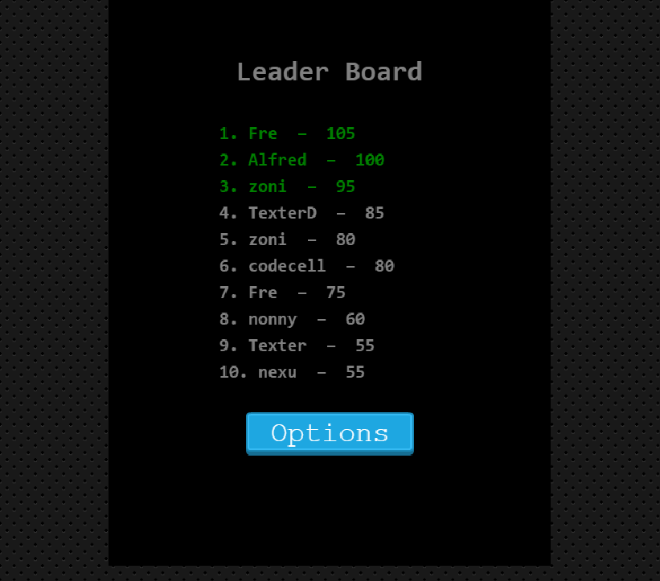
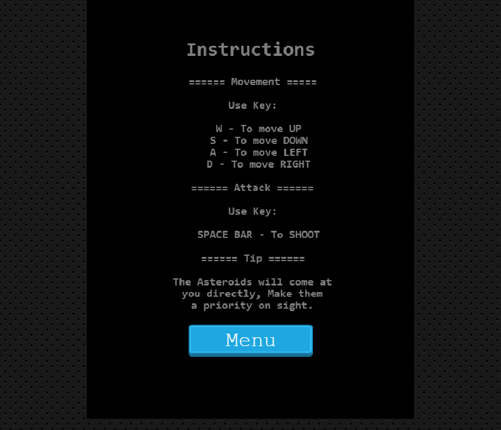

# Shooting Game
This is a custom implementation of the popular space shooter game using the [Phaser](https://phaser.io/) library.

## Outline
- [Live version](#Live-version)
- [UI Preview](#UI-Preview)
- [Description](#Description)
- [Credits](#Credits)
- [Technologies used](#Technologies)
- [Installation](#Installation)
- [Unit Tests](#Unit-Tests)
- [Author](#author)
- [Licence](#licence)

## Live version
The game is hosted here => [fightgame](https://fightgame.netlify.app/).

## UI Preview

|                |                |
|----------------|----------------|
|||
|||


## Description
  This is basically a shooter desktop game, a single-player game. The player has 3 enemy objects(An Artificial Intelligence-powered Asteroid and 2 enemy spaceships) to either gun down or avoid completely. 
  The game can be controlled with the following commands;
  ###  
        ====== Movement =====

                Use Key:

                  W - To move UP
                  S - To move DOWN
                  A - To move LEFT
              D - To move RIGHT

            ====== Attack ======

            Use Key:
            
              SPACE BAR - To SHOOT

            ====== Tip ======

            The Asteroids will come at
            you directly, Make them
            a priority on sight.
                  
          
  ## Scoring
  For each successful shootdown of an enemy, a player is awarded 5 points.

## Credits
  Much appreciation goes to the following for making available the assets used for making this game, accessed from [Opengameart.org](https://opengameart.org/).

  a. Explosion Sounds: [Master484 ](https://m484games.ucoz.com)

  b. Asteroid: DcZanick

  c. Background: Scorcher24

## Technologies
- The game was developed with [Phaser](https://phaser.io/).
- HTML5
- Javascript
- CSS
- [Webpack 4](https://webpack.js.org/) for managing javascript assets.
- [Github Actions](https://github.com/features/actions) for CI.


## Installation
Follow the steps below run the game in a local environment; First ensure you have [Node.js](https://nodejs.org).

1. Clone the repository from a terminal 
    ```git clone https://github.com/codecell/shooting_game.git```.
2. Navigate to the project directory.
    ```cd shooting_game```
3. Install project dependencies.
    ```yarn OR npm install```
4. Start the webback server.
    ```npm run start```
webpack will automatically serve the compiled build on http://localhost:8081/.

## Unit-Tests
After cloning this repo, in the terminal
1. Run  ```yarn OR npm install``` to install project dependencies.
2. Run ```npm run test ``` to run the unit tests locally.

## Author

👤 **Alfred Ezaka**

- Github: [@codecell](https://github.com/codecell)
- Twitter: [@the_codecell](https://twitter.com/the_codecell) 
- Linkedin: [ezaka alfred](https://www.linkedin.com/in/alfrednoble/)

## Show your support

Give an ⭐️ if you like this project!

## Licence
- MIT